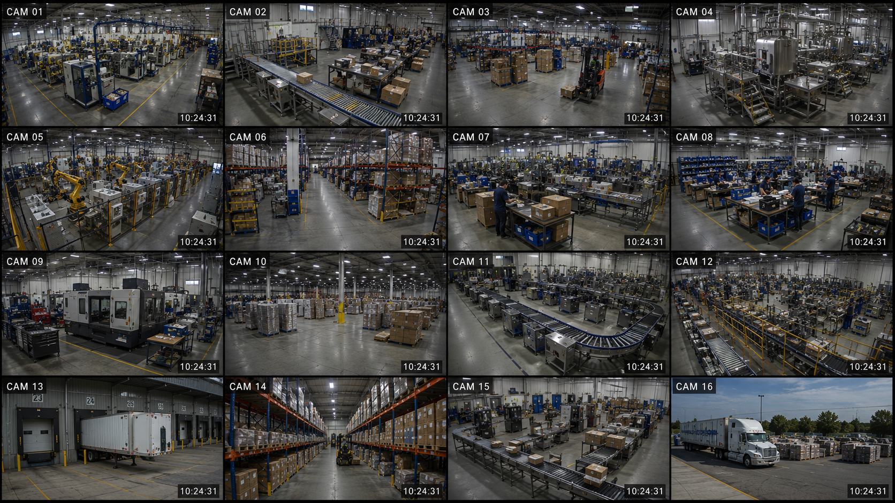
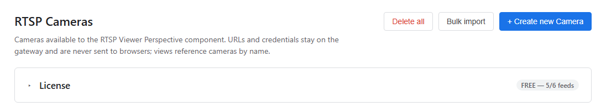
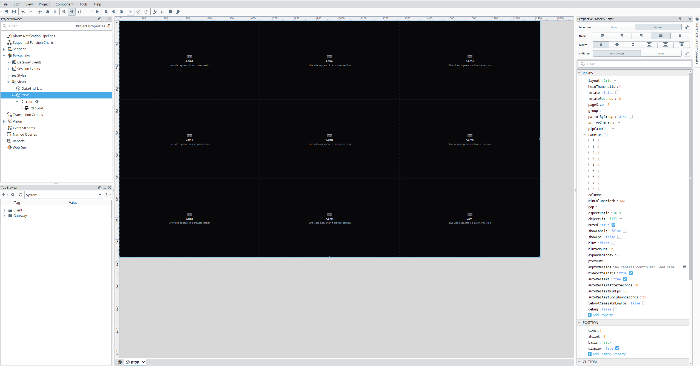

# RTSP Viewer for Ignition 8.3 — Free Edition

> **This is the Ignition 8.3+ build.** Running **Ignition 8.1**? Use
> **[CVISupport/RTSP-Ignition-8.1](https://github.com/CVISupport/RTSP-Ignition-8.1)** instead — same
> product, built for that platform line. A Gateway runs one or the other; installing the wrong one is
> harmless (it refuses to start and says so in the Gateway log). License keys and Perspective views
> work on either.

View live IP-camera **RTSP** streams natively in **Ignition Perspective**. A gateway-managed relay
repackages each camera's existing stream for the browser — **without re-encoding it** — and plays it
in an **RTSP Camera Grid** component. No browser plugins, and no transcoding, so image quality is
untouched and a screen full of cameras costs the Gateway very little.

This repo distributes the **free, limited edition for Ignition 8.3+** (up to **6 camera feeds**). Paid tiers lift
the limit — see [Editions](#editions).

**Two delivery modes.** **HLS** (the default) rides the Gateway's own web port — no extra ports, works
anywhere the Gateway is reachable, a few seconds behind live. **WebRTC** is optional and gets you
**under a second** of latency, but sends video direct over a UDP port you must open and only works on
the **same network**. See [Low-latency mode](#low-latency-mode-webrtc).



*A camera wall running live in a browser Perspective session.*

---

## Download

Get the latest `.modl` from the **[Releases](https://github.com/CVISupport/RTSP-Ignition-8.3/releases)** page.

> This build is **self-signed**. On install, the Gateway shows a one-time certificate prompt —
> review the fingerprint below and accept it. Nothing else is affected.

**Signing certificate — SHA-256 fingerprint** (verify before trusting):
```
FC:62:F4:68:A5:0D:AA:57:D4:6E:B6:05:BE:C0:5E:C9:C4:C3:DE:79:A5:14:02:20:C8:9B:92:07:CD:6A:A1:DF
Subject: CN=Central Valley Ignition, O=Central Valley Ignition, L=Fresno, S=CA, C=US
```

---

## Requirements
- **Ignition 8.3+** — standard, **Maker Edition**, or unlicensed trial mode. *(Edge is not supported —
  IA requires Edge modules to be whitelisted.)* On **Ignition 8.1**, use the
  [8.1 build](https://github.com/CVISupport/RTSP-Ignition-8.1) instead.
- Cameras providing an **H.264** RTSP stream (H.265 must be switched to H.264 on the camera)
- View camera feeds in a normal **browser** (Chrome/Edge) — this is the supported configuration.
  **Perspective Workstation** can also display them, but does not play H.264 out of the box; see
  [Perspective Workstation](#perspective-workstation) below.

## Install (Gateway)
1. Gateway web UI → **Config → Modules** → **Install or Upgrade a Module…**
2. Choose the downloaded `.modl` → **Install** → accept the certificate prompt once.
3. **Restart the Gateway** — on Ignition **8.3+** a module install or upgrade only takes effect after a
   restart. The module then shows **Running** under Config → Modules.

## Add cameras (Gateway)
1. **Config → Connections → RTSP Cameras** → **+ Create new Camera**.
2. Enter a **Name**, the **RTSP URL** (with any credentials), optional substream/zone.
3. Save. Camera URLs/credentials stay on the Gateway — never sent to a browser.
4. Free edition allows **6 enabled cameras**; the 7th is blocked until you upgrade.



## Add the component (Designer)
1. Open a **Perspective** view.
2. From the **Central Valley Ignition** palette category, drag **RTSP Camera Grid** onto the view.
3. Leave `cameras` empty to show all, or list cameras by **name**. Save and open a Session.

*In the Designer, tiles show a placeholder — live video only renders in a browser Session:*



Full guide: **[HOWTO.pdf](https://github.com/CVISupport/RTSP-Ignition-8.3/releases)** (attached to the release).

---

## Low-latency mode (WebRTC)

By default the component uses **HLS**, roughly **2–6 seconds** behind live — fine for monitoring, not for
someone reacting to what they see. Switching the grid's `transport` property to `webrtc` drops that to
**under a second**.

What it costs you:

| | HLS *(default)* | WebRTC |
|---|---|---|
| Latency | ~2–6s | **< 1s** |
| Works over internet / VPN | **Yes** | No — same network only |
| Setup | Nothing | Set one property; open a UDP port only if needed |

Only the initial handshake goes through the Gateway; the video itself is sent straight from the
Gateway machine to each browser over a UDP port (default `18189`). Many networks need no firewall
change for this, since the Gateway initiates the connection and the reply returns through the same
opening — but if viewers can't get through, allowing that port inbound fixes it.

A tile that can't establish a connection **falls back to HLS automatically**, so a blocked port means
higher latency rather than a black screen — and the Gateway reports which cameras fell back and why.

Configure it under **Config → Connections → RTSP Cameras → Connectivity**, which also shows the
addresses browsers will be told to use and includes a **Test from this browser** button.

> **Free while in preview.** Low-latency mode is included at no cost in this release. It may move to a
> paid tier in a future version; existing installs will be given notice.

---

## Perspective Workstation

RTSP Viewer works in Perspective Workstation, but **not by default**.

Workstation's embedded browser ships with H.264 playback **disabled**. Until it is enabled, camera
tiles stay black while the rest of the view renders normally — whether the view holds one camera or
twenty. Enabling it is a change you make to your own Workstation installation: a JVM flag in
Workstation's launcher config. It is off in a stock install, and neither Central Valley Ignition nor
this module turns it on for you.

### What this module does and does not do

- It **does not** contain, install, bundle, or distribute an H.264 decoder or any other codec.
- It **does not** transcode or re-encode video. Frames are relayed from your camera to your browser
  exactly as the camera produced them.
- It **does not** modify Ignition, Workstation, or any Inductive Automation software.
- The decoder used in Workstation is part of Workstation, not part of this module.

### Your responsibility

Decoding H.264 can carry patent-licensing obligations, depending on your jurisdiction, your
deployment, and how you use it. If you enable H.264 playback in Workstation, **you are responsible for
determining and meeting any licensing obligations that apply to you**, including any AVC/H.264
patent-pool terms. Central Valley Ignition provides no license, sublicense, or indemnity for H.264
decoding.

---

## Editions

| Edition | Camera feeds | Notes |
|---------|-------------|-------|
| **Free** | 6 | This download. Perpetual. |
| **Pro** | 24 | Single gateway. |
| **Unlimited** | Unlimited | Single gateway. Capacity depends on your hardware. |
| **Integrator** | Unlimited | Multi-gateway. |

Upgrading is a license key — no reinstall. **[Contact us](#support)** with your Gateway ID
(shown on the License card in the config page) to purchase.

## Support
- Issues / questions: open an **[Issue](https://github.com/CVISupport/RTSP-Ignition-8.3/issues)** or email **Support@CentralValleyIgnition.com**.
- Include your Ignition version and, for camera problems, the camera make/model + stream codec.

## License
Proprietary. Free edition use is governed by **[EULA.md](EULA.md)**. Not open source.

This module bundles two open-source components, used under their own licenses:
[MediaMTX](https://github.com/bluenviron/mediamtx) (MIT) and
[hls.js](https://github.com/video-dev/hls.js) (Apache-2.0). See
**[THIRD-PARTY-NOTICES.txt](THIRD-PARTY-NOTICES.txt)** (full license texts also included in the
module). React/React-DOM are provided by the Ignition Perspective runtime and are not bundled.
